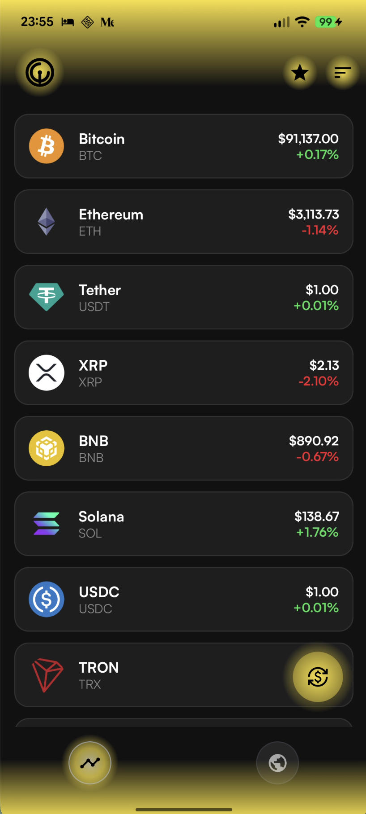
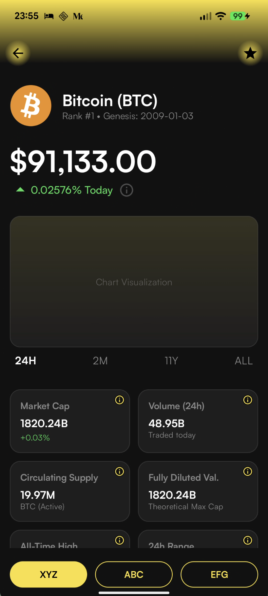
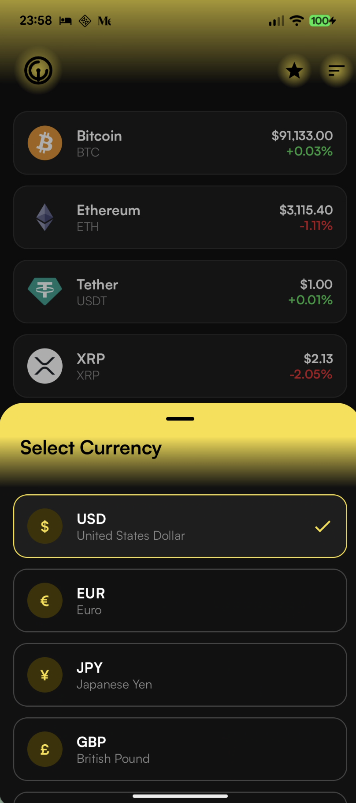
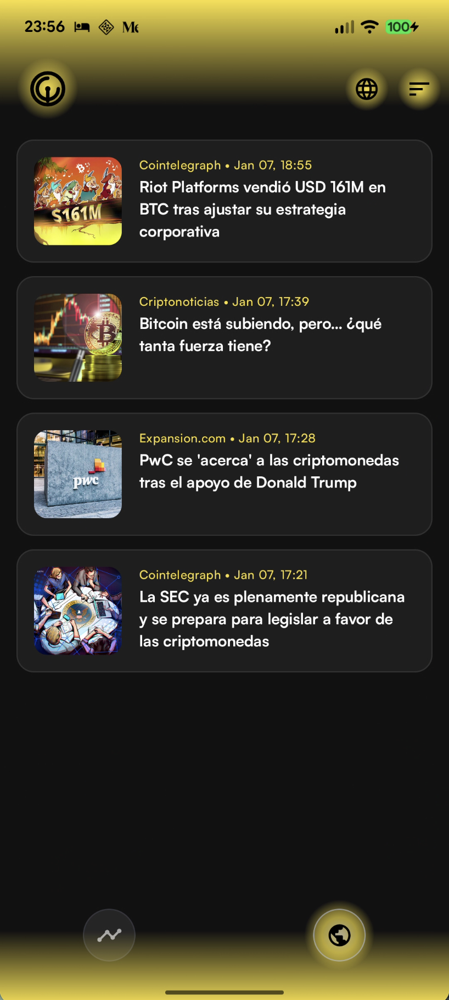
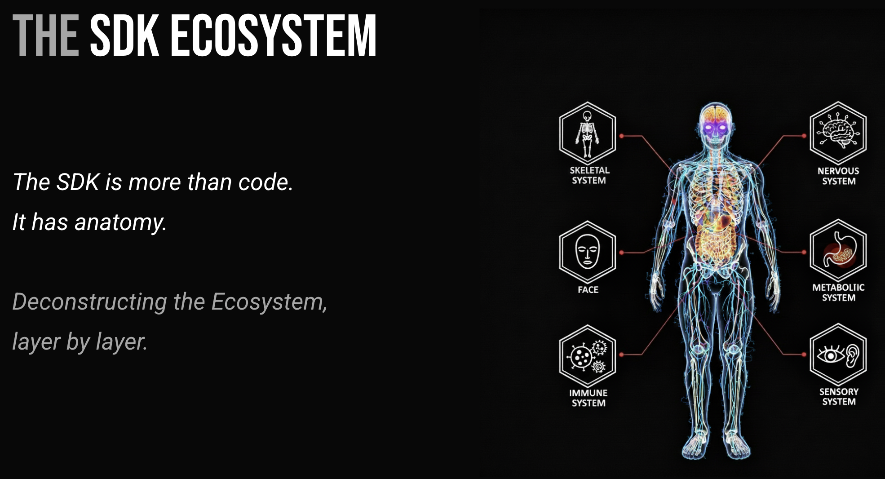

# SDK Crypto ecosystem

Case study of the SDK ecosystem with real crypto use-case.

### 🛡️ CodeGuard Status

| Pipeline Step       | Status                                                                                                                                                                                                     | Description                         |
|:--------------------|:-----------------------------------------------------------------------------------------------------------------------------------------------------------------------------------------------------------|:------------------------------------|
| **Formatting**      |           | Code style and formatting checks    |
| **Static Analysis** |               | Kotlin static analysis and linting  |
| **Module Versions** |  | Module versions verification        |
| **Unit Tests** |       | JUnit logic verification            |
| **Device Tests** |    | Android Instrumented tests (API 35) |

## Sample app

<table>
  <tr>
    <td>
      
    </td>
    <td>
      
    </td>
  </tr>
<tr>
    <td>
      
    </td>
    <td>
      
    </td>
  </tr>
</table>

## Documentation

[SDK Documentation pages]

### GitHub
SDK Documentation pages source code is available on separated GitHub:  
https://github.com/kotoMJ/android-sdk-crypto-ecosystem-doc

### Versioning
SDK Ecosystem implements content based automated versioning.  
For details about versioning visit [SDK Versioning] section.

### Backend For Frontend
SDK Ecosystem has its own backend for frontend in order to handle API keys securely.

Complete backend code is available on separated GitHub:
https://github.com/kotoMJ/sdk-crypto-ecosystem-bff

For details about BFF authentication (Play Integrity vs debug bypass) see [BFF Authentication].

### Public Speaking
Basic principles of the SDK Ecosystem was presented on public Android meetups in Brno and Prague (Czech Republic)
and here are slides from Prague meetup:

**November 18, 2025** - Android Meetup in Prague at STRV   

## Contribution

In order to contribute to this codebase read [Conventions] part.

[SDK Documentation pages]: https://kotomj.github.io/android-sdk-crypto-ecosystem-doc/
[SDK Versioning]: sdk/bom/VERSIONING.md
[BFF Authentication]: docs/bff-authentication.md
[Conventions]: extras/CONVENTIONS.md
